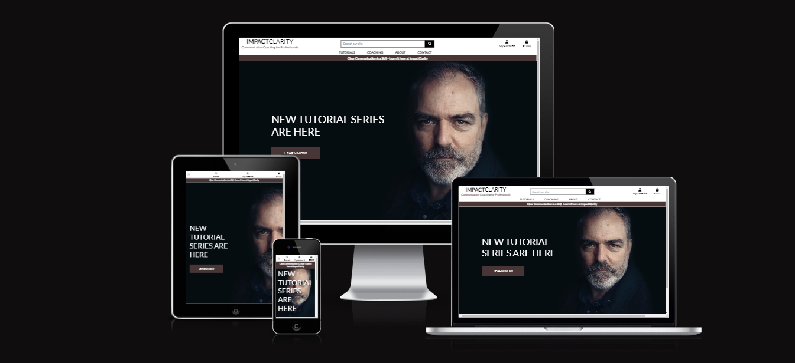
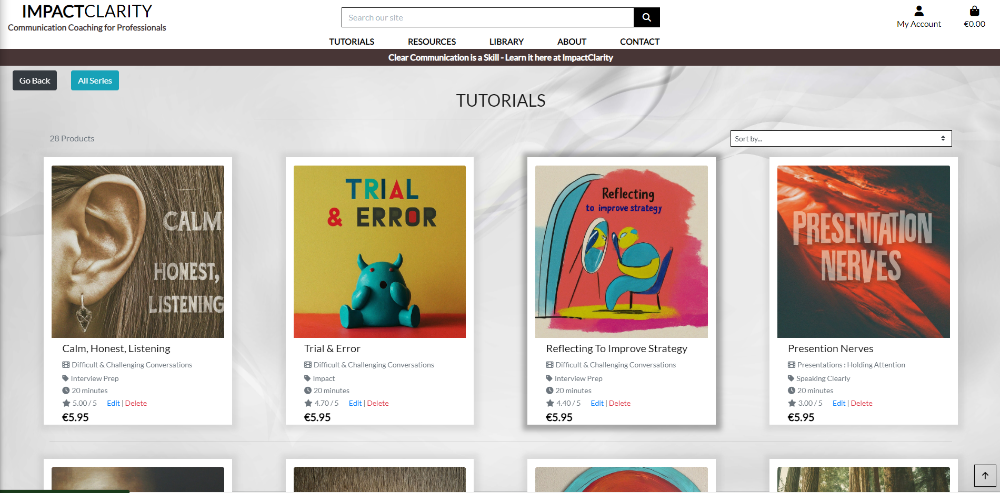
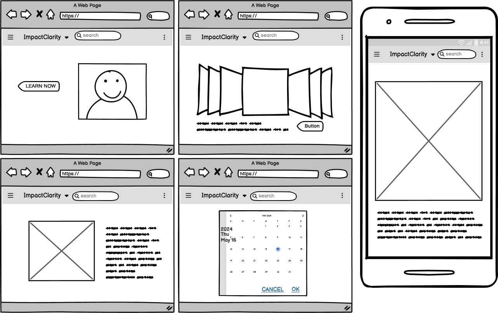
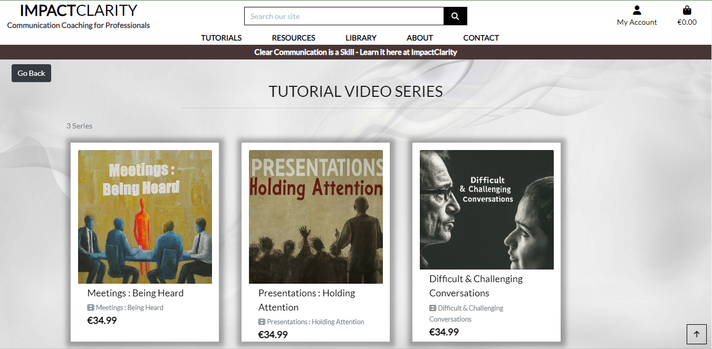
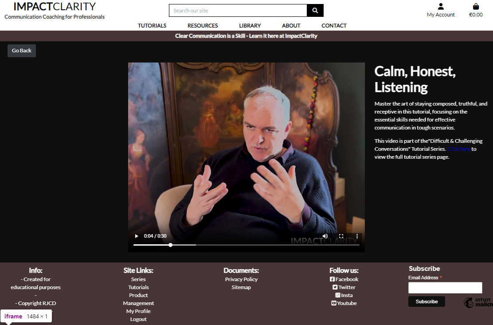
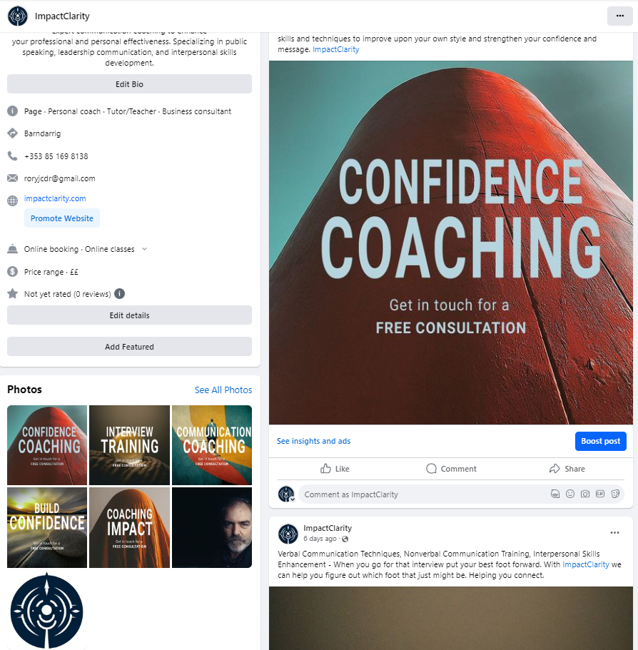
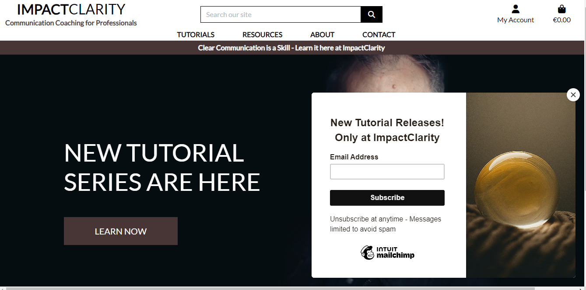
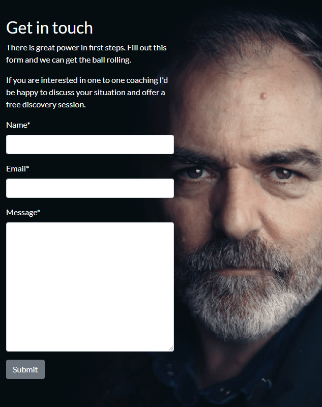
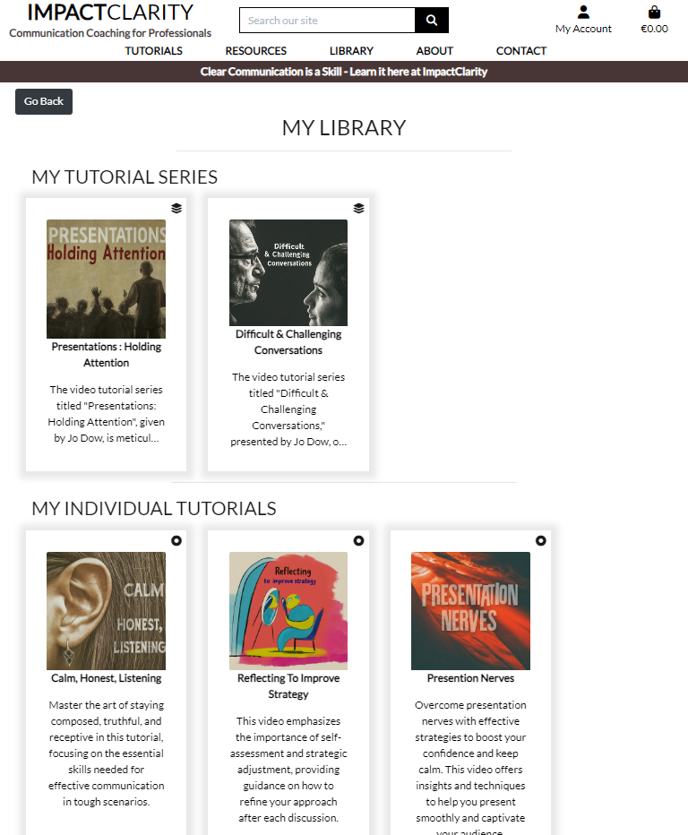
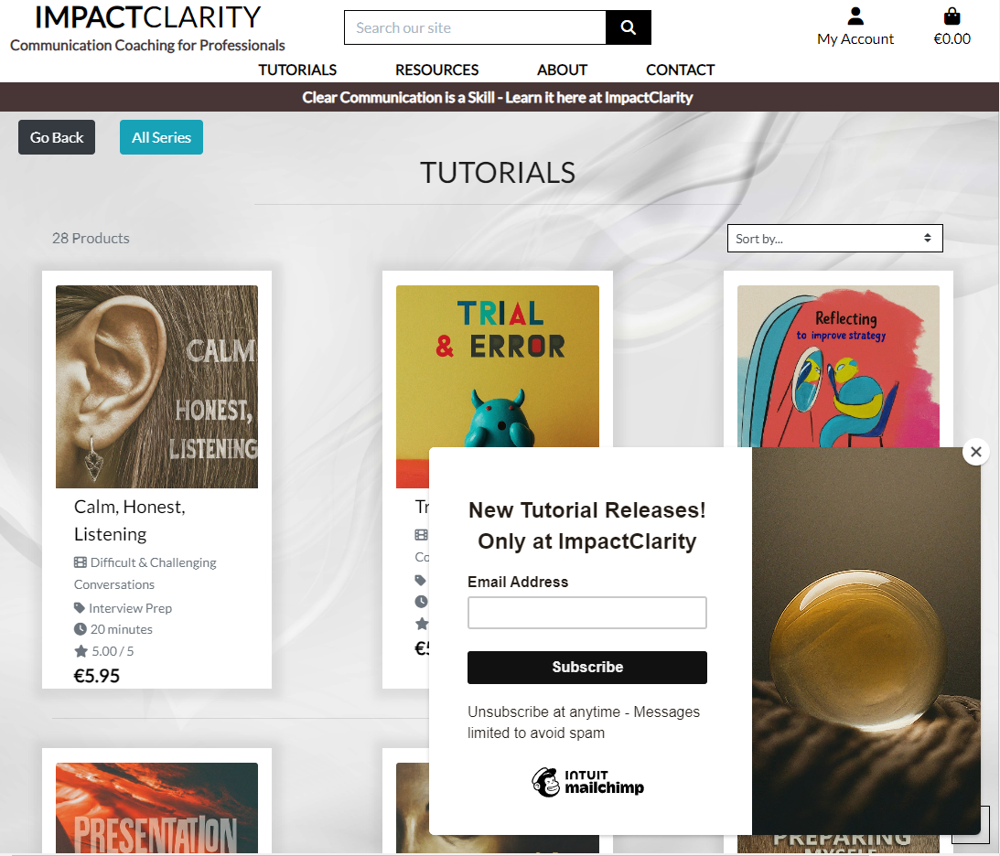

# Impact Clarity Coaching - A Communication Coaching Website
 

## Overview
This project is designed and developed as a platform for a communication coaching business. User's are able to purchase access to educational videos in single units or sets of videos. They are also able to read about the coach, in this case Jo Dow, and make contact to arrange coaching sessiong as well as access resources recommended by the coach. All these functionalities are available to any user with an account.  
The website was created for private clients to purchase tutorials, B2C, its a private educational platform for professionals to learn techniques to improve their communication in the workplace.  
**Impact Clarity Coaching** was developed using Python (Django), HTML, CSS and JavaScript by storing the data in a PostgreSQL database.
  
The fully deployed project can be accessed at [this link](https://www.impactclarity.com/). 
If that does not register as secure when you visit it means the ssl certificate generated for the site may have expired. Use this link to visit the heroku direct url [here](https://impactclarity-158dbf752d6b.herokuapp.com/)
  

The sites payment system uses Stripe. The connection is set in test-mode so no real money is taken if you process a purchase. To remain extra safe it's recommended you use card details offered by Stripe for this purpose. Here is one set of details for a test card below, feel free to use this one. 

Card No: 4242 4242 4242 4242, expiry any future date, CVC is any 3 numbers, and if it requests a ZIP code use anything that fits the format, 90210 is an example code used during the testing of the site. 

## Site Features :
- Single Payment system (not subscription), using Stripe. Users can pay by card or using ApplePay or GooglePay.
- Purchasing video tutorial access and series access
- Newsletter sign-up modal
- Privacy Policy procedures displayed
- About the Coach Section
- Contact form for feedback or organising coaching sessions.
- A resources section
- Login with email, username or social accounts links, namely Google  
- Site bespoke domain
- Fully accessible with hidden features for users with disabilities, image tags and text on all features for clients with screen readers.
- links to coach related social accounts

## Business Plan & Analysis :
- After **discussion with a coach** currently working in the industry it's clear this is a **premium service**, generally expected to be more expensive than psychotherapy sessions for example which have a continuous expectation of repeated sessions, Communications Coaching is more often a sort of finishing schooling, sometimes a single session is all that's required to teach the necessary skill or technique to solve a clients specific challenge. Most commonly a **short set of 5 or 6 sessions** is what clients settle on. They iterate and perfect communication techniques by taking what they have learned in a session back into their lives, trying it out, then returning to the coach with the result for further development, practice and advice. This model means that clients have a much shorter half-life in communication coaching than in other comparable coaching industries. An active media strategy to encourage high enough traffic to make the business sustainable is required for this reason. 

  

- **Video tutorials** are purposefully affordable, designed to encourage sign up to online or in-person coaching sessions. They are an introduction to the coaches voice and style. 
- Some customers will be satisfied with videos, this acts as **passive income** for the coach and filters favourable clients who are familiar and already like coach’s style.
- Video tutorials are 25 minutes each. They are released in **Tutorial Series**. Access to Tutorials and Tutorial Series can be **purchased individually or bundles**.

- €5.95 for a single video tutorial, €34.99 for Tutorial Series of 8 or more videos. This is considered relatively cheap as the clients who usually require this service are already successful in their field and looking to hone their interpersonal skills to a fine point. Pricing is difficult from the persepective of the coach, too high and you alienate a portion of your client-base, too low and you undervalue yourself. We have to balance self-valuation with accessibility. Openly addressing this costing challenge in the content can be the most confident thing to do. Stating something along the lines of "videos have been made affordable because session are where the majority of progress is made".

- My discussion with a working coach made it clear that there is a large range of pricing based on the client themselves. **Students** looking for interview preparation are given vastly reduced rates compared to **CEOs** of large companies which differs again from **civil servants** working in politics for example. In the cash-in-hand analog world this is simple, the coach changes the rate by simply saying a lower or higher number in the moment and agreeing this with the client. When we try to systematize this for the **online business** we need a discreet (in both senses) method for this so that clients paying higher prices do not feel that the price is unfair or inflated. My solution to this is a dynamic system for the Coach User to generate and distribute discount codes along with differentiated coaching sessions.
- **Discount codes** need to work cleanly and effectively so they can be distributed on **social media**, in **newsletters**, in **direct communications**. We can also use the account registration process to filter the users and target which grade of discount is sent to them in emails, or even inside on-site advertisements. 

- A **newsletter with subscription** option needs to open once with a pop-up including offer of discount. Repeated pop-up are a nuisance and have been avoided. Newsletter is distributed each time a new set of videos is released, or at major events deemed by the coach. I believe a policy of **minimizing spamming** registered clients will encourage retainment of this client-base.

 

[pdf of newsletter](static/pdfs/ic_email_newsletter.pdf)

 

- **Contact form** for In-person sessions. This is a more intimate service but it is an extension of the business and needs to be available via the platform. 

- **About Section** needs to address the history of the coach and blend every story with how that relates to the type of coaching being offered. 

- **Testimonials** (unfortunetly fabricated, currently) are a chance for helpful, honest and precise advertising of the service being provided. We can create a form for these to be recorded electronically after sessions. Asking professional colleagues of the coach for one liner quotes is also effective. 

- **Resources section**; this is where the coach can show their knowledge and keenness to impart confidence and wisdom on the client. Can be a list of book, sites, videos. Must not redirect to other coaches unless agreed with other coach previously and not funneling business away. Good to inform, no point shooting self in the foot. 

- **Pathing**; un-authorised users can browse all content and videos without playing them while not logged in. Only logged in accounts can access the videos they have paid for.
Account page of users shows previous purchases and session bookings. Some taster content needs to be available. 

- Only authorised accounts are able to purchase products. All the coaches **payments are contained** to the single platform. No cash or transfers to negotiate.

  

## Aesthetics, Vibe & Feeling :
### Confidence / Clarity / impact 
- Practicing what you preach is important. Messages and processes need to be extra clear and effective.
- There is a tendency towards some pushy salesmanship from some coaches site. This could be a culture thing within subsets of the industry. Driving with negative fear building statements (“you don’t know what you’re missing”, “can you afford not to take this course”). But I really don’t like this and think there is a gentle pragmatic approach that allows the client to come to you willingly or walk off if they feel it’s not right. 
- This positive gentle approach also fosters a more positive community, client retention and recommendations by word of mouth. 
- Aesthetically there needs to be a clear brand image. A logo and continuation in the typography. 
- Classy, legible, soothing tones. I like off-white skin tones with a single bolder brand colour lightly sprinkled in. 
- A three word mantra for a tag line. This defines your brand. They are the words the client says to their friend across the water cooler.
- A Trustworthy, Quality service, Approachable by all.

  

## CONTENT TYPES :
Content always needs to include a practical tips for the client. What can they do to improve. It's easy to wax lyrical about confidence and communicating when talking to a camera. We are naturally used to a back and forth interaction, this is when we conversationally handover useful tips organically. However defining this as a media policy encourages the coach and content editor to remember that this is not a standard conversation and they need to impart useful advice as if the user had already expressed their problem and requested specific assistance in the area the video is focusing on.  
#### example of problem behaviour / description of why people do this / practical solutions 

### Example Video Tutorial Series: 
    - Confidence Vocal Techniques
    - Clarity in Body Language
    - Managing Confrontation 
    - Business Communication 
    - Confident Lifestyle Choices
    - Communicating in Close Relationships
    - Parenting - Communicating with Children
    - Women in Business - Dealing with Challenges
    - Successful Interview Technique
    - Managing People with Clarity
    - Impact Public Speaking
    - Feeling Comfortable in Social Settings
    - First Impressions with Gravity

  

### Standards: 
- Video quality needs to be high, sound quality needs to be immaculate, setting should be calming and focused on coach. No AI blur effects. Waist to head unless legs are needed for content. Looking at the lense. Should feel natural, like a one to one. 
- These are tasters for clients to feel a little of what a coach’s E-session feel like. They should feel satisfied with the content and keen absorbers should want to feel comfortable with wanting to ask more questions, this is what sessions are for. 
- Complex videos should be book ended with an acknowledgment that this is an overview and that watchers who find the content helpful but feel they need more should reach out for a free discovery chat which came included with their account, don’t push bookings or further payments. Clients and coach need to speak and see how coach can help first.
- Always remember this is a human interaction in which we are overcoming the distance caused by the camera.

  

## Social Media Theory:
### Instgram Post Schedule:
- Rotate one of each of these types of posts daily:   

- Video with useful tip taken while walking
- Board with quote from someone coach admires and a break down of what that means to them in the post notes
- Board advert for coaching session or the site (boiler plate post notes)
- Video snippet from an interview with coach
- Board advice for specific client demographic in need of coaching for communicating
- Board advert for tutorial videos
- Video direct to camera with advice of the week ( this is optional at coaches discretion )
Rinse & Repeat  

#### Instagram content details:
- We will always include an extensive list of keywords hidden within videos and images for search engine optimization to reach the largest number of relevant users connect by the social platforms algorithm.
- A backlog of this content can be made so that posting is a 5 minute activity for the coach each morning or every other morning. 
- Creating an account which is connected to as many organisations and groups as possible to increase reach of content to users who are interested is key to this social media strategy. 

#### Facebook content details:
- The Facebook business page the same content as instagram and could easily use the same copy and images. For added networking via the facebook algorithm the coach or a media manager would need to be on this daily and staying in contact with other. 
- View ImpactClarity's Facebook business page [here](https://www.facebook.com/profile.php?id=61559749910439)
- Or is the Facebook algorithm catches the page for not being a real business [here](https://impactclarity.s3.eu-north-1.amazonaws.com/static/pdfs/impact_clarity_facebook_business_page.pdf)
or [here](static/pdfs/impact_clarity_facebook_business_page.pdf)
  

## UX
This site was created respecting the Five Planes Of Website Design: Surface, Skeleton, Structure, Scope, and Strategy 
### Strategy

**User Stories:**  

|   EPIC                                |ID|                                User Story                                                   |
| :-------------------------------------|--|:------------------------------------------------------------------------------------------- |
|**CONTENT AND NAVIGATION**             |  ||
|                                       |1A| As a user, I want to see a nav menu so I can easily navigate through website content|
|                                       |1B| As a user, I want to understand the purpose of the site|
|                                       |1C| As a user, I want the website to have a nice and intuitive design which I recognise|
|**USER REGISTRATION/AUTENTHICATION**   |  ||
|                                       |2A| As a user, I want to be able to register on the website|
|                                       |2B| As a user, I want to be able to authenticate using only email and password or a social|
|                                       |2C| As a user, I want to be able to log out at any time|
|**Tutorials & Series**                 |  ||
|                                       |3A| As a logged-in user, I want to be able to search through existing tutorials and series|
|                                       |3B| As a logged-in user, I want to be able to easily purchase tutorials and series|
|                                       |3C| As a logged-in user, I want to be able to watch my tutorials easily|
|**Shopping**                            |  ||
|                                       |4A| As a logged-in user, I want to be able to pay by card|
|                                       |4B| As a logged-in user, I want to recieve a reciept|
|                                       |4C| As a logged-in user, I want to be able to see my bag before I pay|
|**USER PROFILE**                       |  ||
|                                       |5A| As a logged-in user, I want to save my details|
|                                       |5B| As a logged-in user, I want to have a clear navigable collection of my purchases|
|                                       |5C| As a logged-in user, I want to be able to easily rewatch tutorials|
|**About**                              |  ||
|                                       |6A| As a logged-in user, I want to know as much as possible about the coach before I buy content|
|**CONTACT**                            |  ||
|                                       |7A| As a user, I want to see the websites contact details to raise an issue or make an enquiry|

**Project Goal:** 
Create a website for purchasing and viewing purchased content with the goal of both teaching users new skills for communicating in a professional setting and also draw users to reach out the coach for one-to-one coaching sessions.

**Project Objectives:**  
* To create a website with a simple and intuitive User Experience;
* To add content which is relevant and informative;
* To differentiate between user accounts, coach accounts and an admin account for non-code literate business content management;
* To implement fully functional features that will ease logged-in user's experience with the site and help them to integrate it's use into their lifestyle;
* To make the website available and functional on every device.  

### Scope

**Simple and intuitive User Experience** 
* Ensure the navigation menu is visible and functional at any stage of using the site;
* Ensure every page has a relevant name which fits its content;
* Ensure the users will get visual feedback when navigating through pages;
* Ensure the users will get visual feedback when adding items to the bag and going through checkout;
* Create a design which does not confuse users and matches a singluar brand image.

**Relevant content** 
* Tutorials have clear descriptions and category assignment for easy searching;
* Series and Product search pages are clear and well designed;
* Create a clear path from tutorials to the contact page to encourage coach contact for coaching sessions. 

**Features for upgraded experience** 
* The original scope for this project had to be peared down due to time and complexity constraints. In the future I would like to implement all the features which have not made it on to this draft. 
* Site ability to sell coaching tokens which can be exchanged on the site for online coaching sessions.
* A booking system with a calendar and drop down time slots for booking coaching sessions.
* A video conferencing tool to allow sessions to be contained within the site.
* A reminder system to prompt users their session is coming up.
* A gifting mechanic to allow users to gift coaching tokens to another persons email address. 
* Coaches ability to assign tutrials to a users account free of charge without the admin panel. 
* Integrating social media content with the site, widget for instagram posts for example.
* Testimonial posting mechanic for users who have had coaching sessions.
* Review system on the tutorials. 
* Discount code functionality.
* Confidentiallity and code of conduct page for coaching procedures.

**Different client and coach Accounts** 
* Coach accounts are able add series and products;
* Admin accounts can delete database entries which do not meet basic format compliances;
* Client accounts can purchase content, view purchased content and send messages to the coach.

**Responsiveness** 
* Create a responsive design for desktop, tablet and mobile devices.  

  

### Structure

The structure of the website is divided into six pages; with content depending on account specifications  
-The **Home** page is visible for new and returning users, is clear and simple, introduces the coach and directs towards product; 
-**Register/Login** pages are familiar structure and clear; 
-**Logout** feature is always accessible; 
-The **Nav Menu** is the same across all pages however it is simplified before logging in; 
-The **Library** page is only visible for the logged-in clients and displays the logged-in users collection of tutorials and series; 
-The **Profile** is the main display for user details and order history; 
-The **Bag** is clear, structured and easily adjustable; 
-The **Checkout** is extremely clear, doesnt allow for errors and enstills trust; 
-The **Create Product** page allows the coach to add new tutorial content; 
-The **Create Series** page allows the coach to add a new series group for products to be added to; 
-**Contact Us** contains information visible to any users, even without registering, encouraging users to reach out to the coach; 
-The **About** pages contains an introduction to the coach and the site; 

### Skeleton

**Wireframes** 
The wireframes for mobile and desktop were created with [Balsamiq](https://balsamiq.com/) tool and can be viewed [here](static/images/Wireframes.png) 

**Database** 
The project uses the PostgreSQL relational database for storing the data. 
Two diagrams were made to represent the relation between the tables

## Agile Methodology
This project was developed using the Agile methodology. User stories were central in planning steps taken. User stories were broken down into acceptance criteria and these were checked off using githubs project KanBan board functionality. These can all be seen publicly attached to this repo.
  

 

## Features
### Existing Features

#### Create, Read, Update, Delete
 

 
#### Client Profiles
The users' accounts have been created using the **django allauth** module. This way, information about the current user can be accessed from the template and displayed for the user to access the site. The client profile model contains a editable address details, contact details and order history. These are displayed on the user's profile. The profile can be edited easily and has accessible links in the nav to all the user's purchased content, such as their tutorials and video series in the library, for easy access and management. 

### Testing
## Manual Testing
Each user experience function has been manually recorded and tested for functionality and misuse. All functions were successful within the bounds of the testing scheme laid out in the document linked below.

[Manual Testing Documentation](static/pdfs/Manual_Testing_Record.pdf)

The defensive programming has also been tested manually. By finding the url of a particular page, then logging out, and attempting to access this same url. The @login_required decorator on the views for protected content stops unauthorised users from accessing anything other than content open to the public or pages they have paid for acces to. The @login_required addition to settings allows us to set a specified redirect for any unauthorised attempt to any accepted url and view which uses this decorator. My setting simply returns the attempt to the index. 

The admin functionalities, for creating, editing, deleting, and managing product models in the database has been thoroughly tested in the making of the site.  

Media uploads have all been tested for various ranges of aspect ratios and sizes. The worst of these requires some extra scrollings but allow users to view even the most distended of video format with a simple zoom out and all pages remain responsive.

## Django Testing

All forms and views were tested for validation and unvalid responses.

## Validator Testing 
[JsHint](https://jshint.com/) - used for validating the javascript code Reports   
[PEP8 Validator](https://www.pythonchecker.com/) - used for validating the python code Report example [here](static/images/testing_04.png)  
[HTML - W3C HTML Validator](https://validator.w3.org/#validate_by_uri+with_options) - used for validating the HTML  
[CSS - Jigsaw CSS Validator](https://jigsaw.w3.org/css-validator/#validate_by_uri) - used for validating the CSS Report [here](static/images/testing_05.png)  
[W.A.V.E.](https://wave.webaim.org/) - for testing accessibility Report example [here](static/images/testing_03.png)  
LightHouse - for testing performance Report[here](static/images/testing_06.png) 
Flake8 - for testing all python code for PEP8 standardisation. 

## Unfixed Bugs

There are no unfixed bugs that I am aware of at this time. My aim was to have everything which is included working smoothly before submission, rather than adding lots of extra features which were not properly tested or unfinished and beyond the requirements of the project scope. Removal of the delivery details fields during checkout was attempted but caused a cascade of errors that cost a whole day to recover from so the feature was left in as it is harmless and does not block the flow of the user experience in a significant way. 

## Responsive Layout and Design
The project design has been adapted to all types of devices using Bootstrap predefined breakpoints and Chrome's DevTools to digitally test the platform across a number of devices. Three specific media queries were added to solve minor layout issues at specific breakpoints.

**Tested devices:**

    - iPhone SE 
    - iPhone XR 
    - iPhone 12 Pro
    - iPhone 14 Pro Max
    - Pixel 7
    - Samsung Galaxy S8+ 
    - Samsung Galaxy S20 Ultra
    - Ipad Mini
    - Ipad Air 
    - Ipad Pro 
    - Surface Pro 7
    - Surface Pro Duo 
    - Galaxy Fold
    - Samsung Galaxy A51/71 
    - Nest Hub
    - Nest Hub Max

## Tools Used

[GitHub](https://github.com/) - used for hosting the source code of the program 
[GitPod](https://gitpod.io/workspaces) - Used as an IDE for the remained of the project, fantastic tool 
[Visual Studio](https://code.visualstudio.com/) - for holding code snippets while new method were tested 
[Heroku](https://dashboard.heroku.com/) - used for deploying the project 
[Balsamiq](https://balsamiq.com/wireframes/) - for creating the wireframes 
[Favicon.io](https://favicon.io/) - used for generating the website favicon 
[Font Awesome](https://fontawesome.com/) - used for the icons 
[Bootstrap5](https://getbootstrap.com/) - for adding predifined styled elements and creating responsiveness 
[Google Fonts](https://fonts.google.com/) - for typography 
[JsHint](https://jshint.com/) - used for validating the javascript code 
[PEP8 Validator](http://pep8online.com/) - used for validating the python code 
[HTML - W3C HTML Validator](https://validator.w3.org/#validate_by_uri+with_options) - used for validating the HTML 
[CSS - Jigsaw CSS Validator](https://jigsaw.w3.org/css-validator/#validate_by_uri) - used for validating the CSS 
[Chrome Del Tools](https://developer.chrome.com/docs/devtools/) - for debugging the project 
[W.A.V.E.](https://wave.webaim.org/) - for testing accessibility 
[AWS](https://aws.amazon.com/) - for storing media and static data 
[LightHouse] - for testing performance 
[mailchimp](https://mailchimp.com/) - used for popups and mailing list management
[elephantsql](https://www.elephantsql.com/) - for the sites database
[PunchSalad](https://punchsalad.com/) - to produce a free SSL certificate necessary to secure the custom domain
[GoDaddy](https://www.godaddy.com/en-ie) - used to purchase and manage the DNS on the custom domain

### Python packages

* asgiref==3.7.2
* boto3==1.34.79
* botocore==1.34.79
* chardet==3.0.4
* crispy-bootstrap5==0.7
* dj-database-url==0.5.0
* Django==3.2.25
* django-allauth==0.41.0
* django-countries==7.2.1
* django-crispy-forms==1.14.0
* django-formtools==2.5.1
* django-storages==1.9.1
* django-summernote
* docutils==0.15.2
* gunicorn==20.0.4
* idna==2.8
* jmespath==0.9.5
* oauthlib==3.2.2
* Pillow==7.0.0
* psycopg2==2.9.9
* python3-openid==3.2.0
* pytz==2024.1
* python3-openid==3.2.0
* requests-oauthlib==1.3.1
* requests
* sqlparse==0.4.4
* s3transfer==0.10.1
* stripe==2.42.0
* urllib3
* whitenoise==5.3.0

## Deployment

### Deploy on Heroku
 1. Create Pipfile 
 
 In the terminal enter the command ` pip3 freeze > requirements.txt`, and a file with all requirements will be created. 
 
 2. Setting up Heroku

    * Go to the Heroku website (https://www.heroku.com/) 
    * Login to Heroku and choose *Create App* 
    * Click *New* and *Create a new app*
    * Choose a name and select your location
    * Go to the *Resources* tab 
    * From the Resources list select *Heroku Postgres*
    * Navigate to the *Deploy* tab
    * Click on *Connect to Github* and search for your repository
    * Navigate to the *Settings* tab
    * Reveal Config Vars and add your Cloudinary, Database URL (from Heroku-Postgres) and Secret key.    

3. Deployment on Heroku

    * Go to the Deploy tab.
    * Choose the main branch for deploying and enable automatic deployment 
    * Select manual deploy for building the App 
    
The live link can be found here - https://impactclarity-158dbf752d6b.herokuapp.com/

## Credits
### Content
* The content of the website is taken from several websites. 
### Media
* All images have been generated using Googles beta AI image generation tool Image-FX (https://aitestkitchen.withgoogle.com/tools/image-fx). 
* All video footage on the site is my own footage taken in interviews with Jo Dow who has given his explicit consent for any and all footage to be used on the site in this capacity. 
* The icons in the footer were taken from [Font Awesome](https://fontawesome.com/)

## Acknowledgements
- Code Institute for the knowledge and all the tutor support. Jo Dow my father for allowing me to grill him about his work and study his business practices. And my amazing wife who is 9 and a half months pregnant as i submit this site for markiing and has been extremely patient with me and my foragings through the web.   

Thank you for taking the time to inspect my project. 